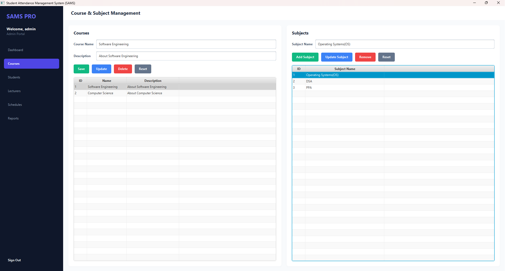
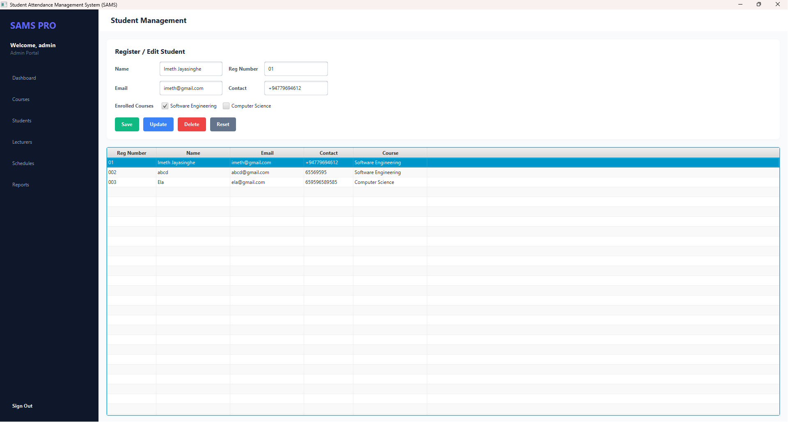
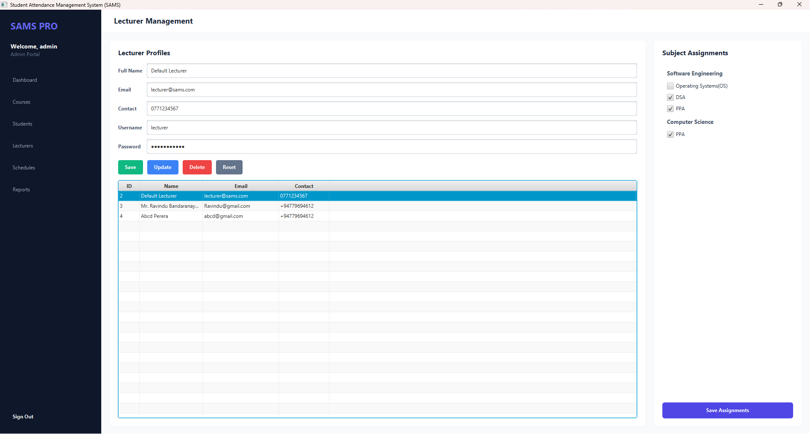
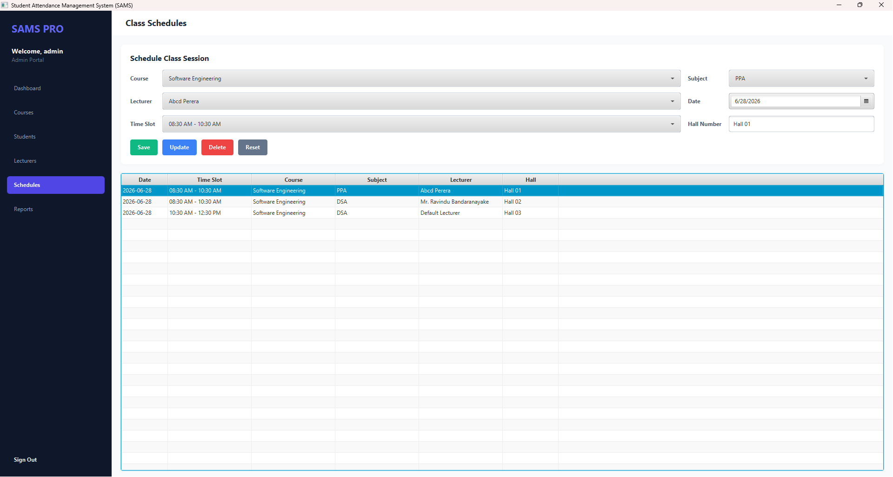
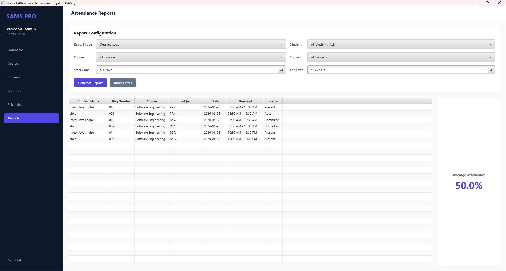
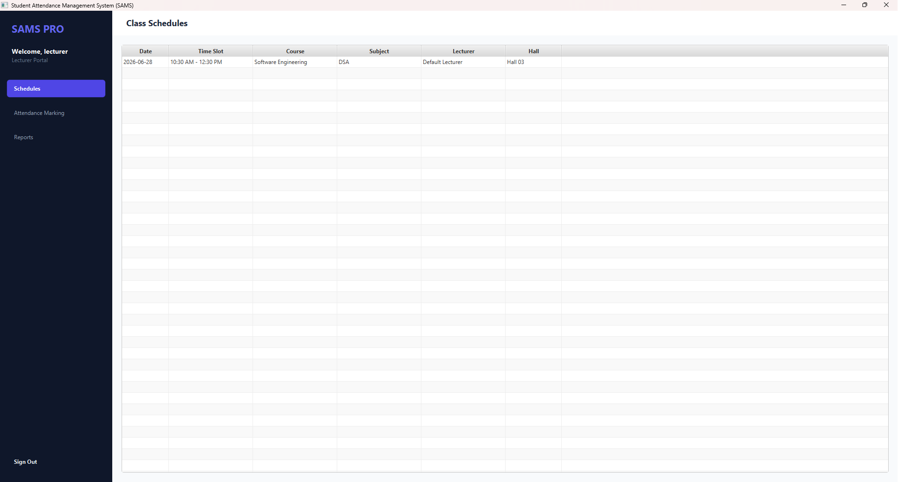
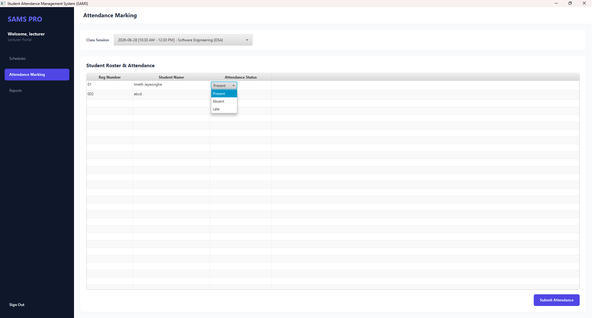
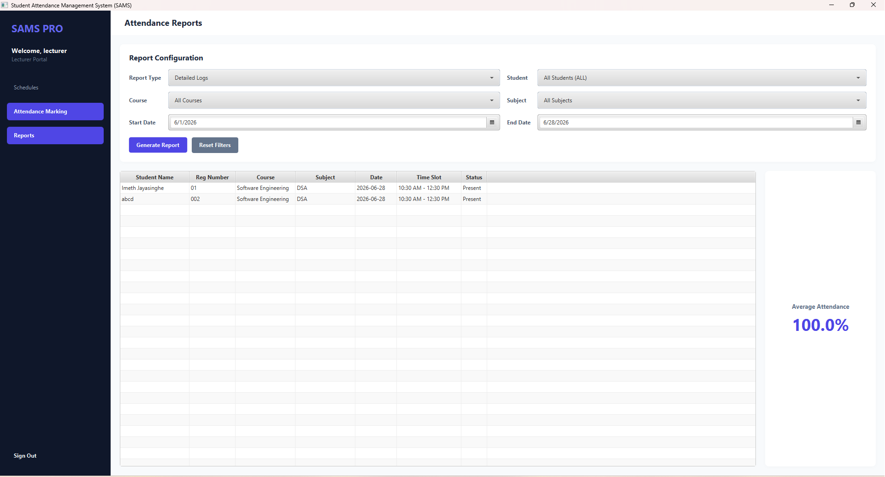

# Student Attendance Management System (SAMS)

A high-performance, premium JavaFX desktop application designed to streamline student registration, class scheduling, attendance tracking, and reporting for academic institutions.

<p align="center">
  
</p>

## Features

- **Role-Based Access Control (RBAC):**
  - **Admin:** Full privileges including course management, student roster, lecturer registry, lecturer assignments, and schedules.
  - **Lecturer:** View scheduled classes, select sessions, retrieve student rosters, record/update attendance (Present, Absent, Late), and generate reports.
- **Course & Subject Registry:** Create courses and dynamically add associated subjects.
- **Lecturer Scheduling:** Assign lecturers to specific subjects and schedule classes indicating date, time slot, and course.
- **Reporting Engine:**
  - **Detailed Logs:** Shows a granular attendance sheet filterable by student, course, subject, and date range[cite: 1].
  - **Summary Metrics:** Calculates total classes, count of present/absent/late, and attendance percentage per student[cite: 1].
- **Aesthetic UI Design:** Polished dark sidebar navigation, modern stat cards, drop shadows, responsive tables, and elegant alignments[cite: 1].

---

## Application Walkthrough & Screenshots

### 1. Authentication
<p align="center">
  
</p>

### 2. Admin Portal Panels
The Admin interface provides full management control over institution registries and scheduling workflows[cite: 1].

| Dashboard Overview | Course & Subject Management |
| :---: | :---: |
|  |  |

| Student Management | Lecturer Profiles & Assignments |
| :---: | :---: |
|  |  |

| Class Session Scheduling | Comprehensive Attendance Reports |
| :---: | :---: |
|  |  |

### 3. Lecturer Portal Panels
A streamlined interface tailored for educators to review schedules and efficiently log attendance data[cite: 1].

| Assigned Class Schedules | Student Roster & Attendance Marking |
| :---: | :---: |
|  |  |

<p align="center">
  <strong>Lecturer Attendance Reports Logs</strong><br>
  
</p>

---

## Technologies Used

- **Development Kit:** Java SE 21+[cite: 1]
- **Database Engine:** MySQL Server 8.0+ / 9.0+[cite: 1]
- **UI Platform:** JavaFX 21 (openjfx)[cite: 1]
- **Data Access:** JDBC with Singleton Connection Pool and Custom SQL Execution Wrappers[cite: 1]
- **Build Tool:** Apache Maven[cite: 1]

## Database Connection Settings

SAMS connects to a local MySQL instance using:
- **Database Name:** `sams`[cite: 1]
- **Host / Port:** `localhost:3306`[cite: 1]
- **Username:** `root`[cite: 1]
- **Password:** `abcd` Use Yours[cite: 1]
- **SSL / Public Key:** Disabled / Enabled respectively for hassle-free connectivity[cite: 1]

## Setup Instructions

1. Ensure MySQL Server is running on your machine on port `3306` with username `root` and password `ijse`[cite: 1].
2. Open a terminal inside the project directory[cite: 1]:
   ```bash
   cd C:/Users/imeth/Desktop/sams